

# Room of Memory · 기억의 방

[한국어](README.md) · **English**

A 15-minute 3D game that runs in the browser.

**[▶ Play](https://room-of-memory.vercel.app)** · Korean / English / Japanese

 

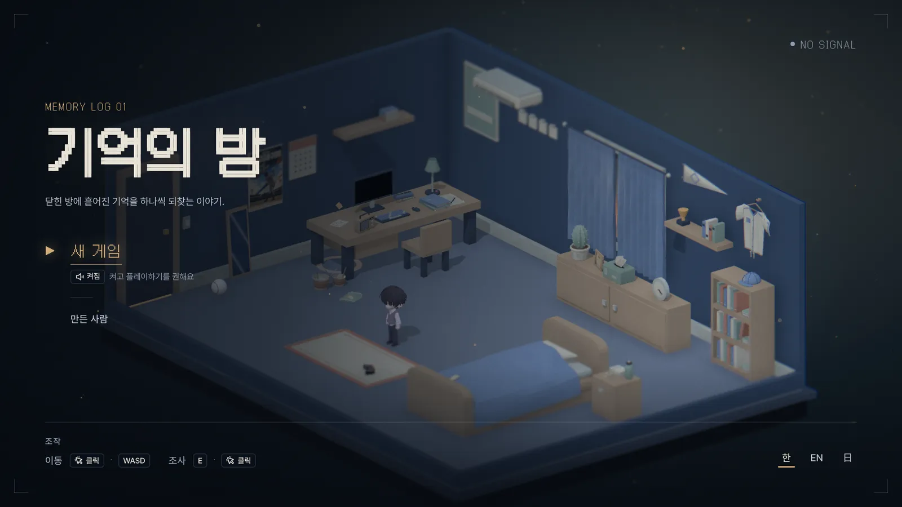

 

## Gameplay video

<a href="docs/readme/demo.mp4">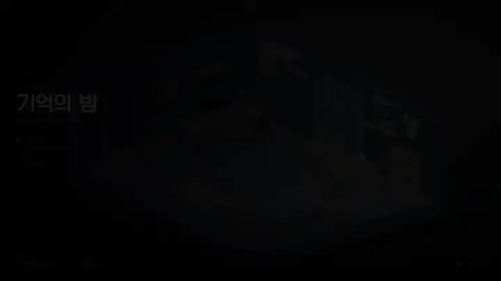</a>

Click to open the video with sound (93 seconds)

 

## Screens

The screenshots below were taken in Korean. The game itself is fully playable in English and Japanese.

<table>
<tr>
<td width="50%"></td>
<td width="50%">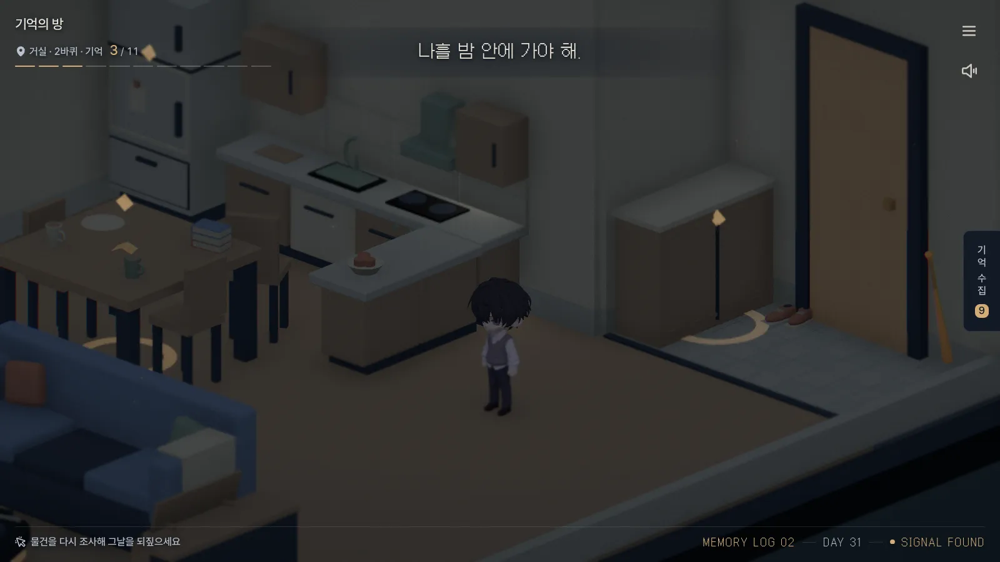</td>
</tr>
<tr>
<td align="center">Bedroom</td>
<td align="center">Living room</td>
</tr>
<tr>
<td>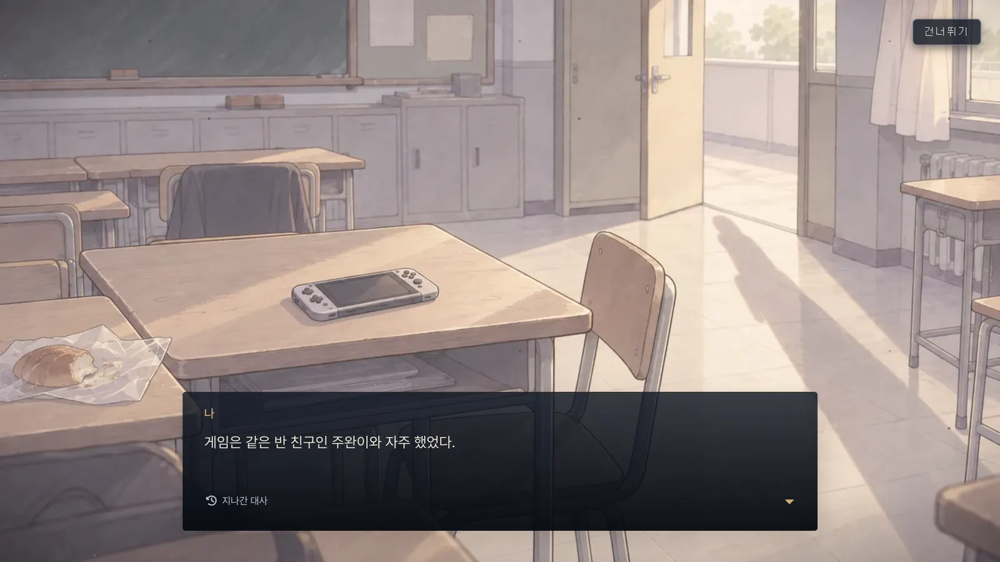</td>
<td></td>
</tr>
<tr>
<td align="center">Flashback</td>
<td align="center">Survivor broadcast</td>
</tr>
<tr>
<td>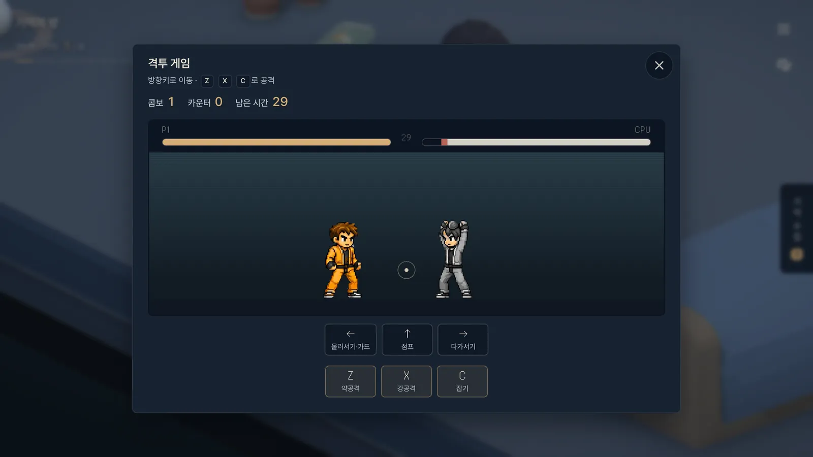</td>
<td>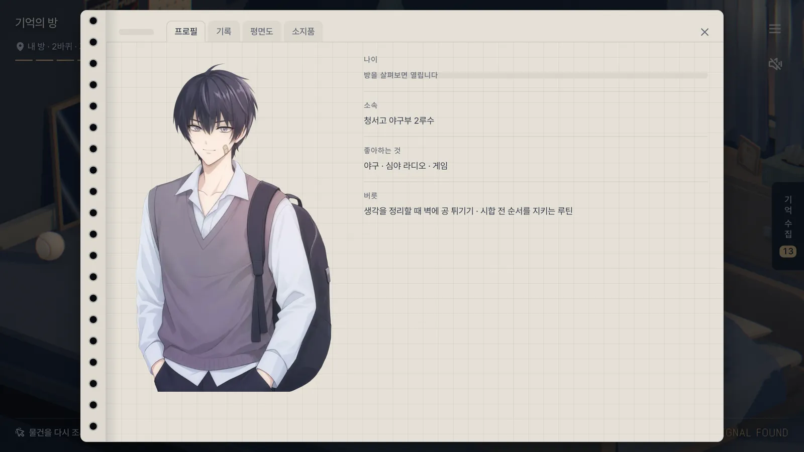</td>
</tr>
<tr>
<td align="center">Minigame</td>
<td align="center">Notebook</td>
</tr>
</table>

 

## Side-story film: *That Summer*

You can watch it again, along with the ending film, from "Watch the films" on the ending card (`/films`).

<a href="public/assets/video/side-story-that-summer.mp4">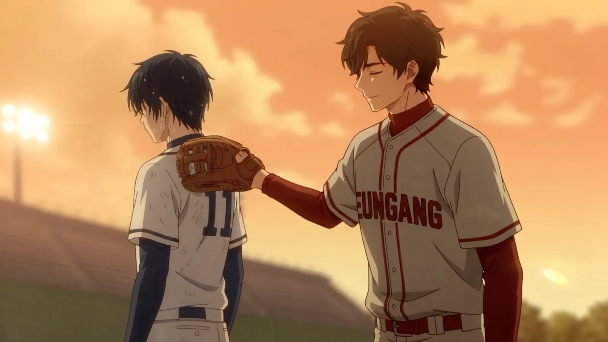</a>

Click to open the video (101 seconds). Best watched after you have seen the ending

 

## Photocard AR

Point your phone camera at the front of the photocard and the character jumps out of it (`/ar`).

<table>
<tr>
<td width="33%">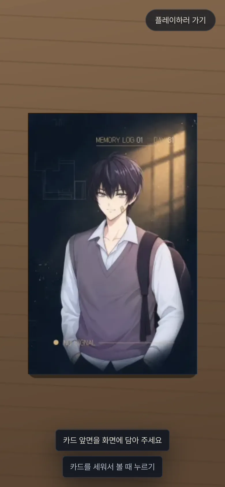</td>
<td width="33%">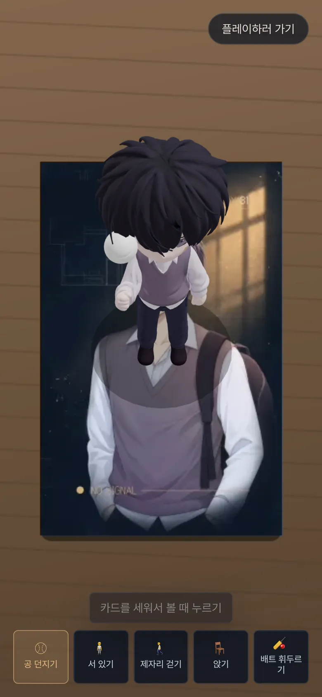</td>
<td width="33%">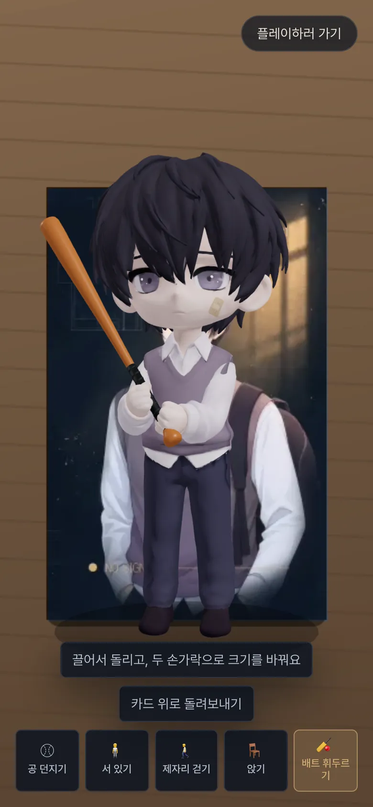</td>
</tr>
<tr>
<td align="center">Scan the card</td>
<td align="center">Jump out</td>
<td align="center">Pick a pose</td>
</tr>
</table>

Captured on a real phone:

<table>
<tr>
<td width="33%">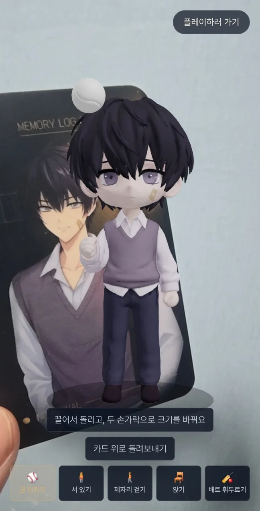</td>
<td width="33%">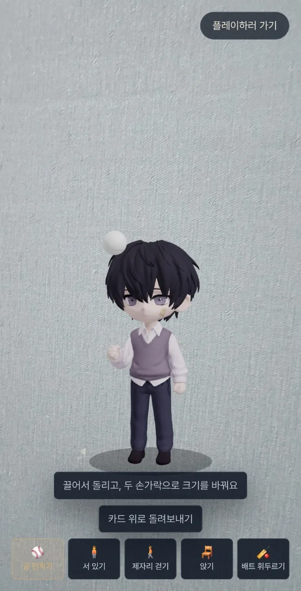</td>
</tr>
<tr>
<td align="center">On the physical card</td>
<td align="center">Placed without the card</td>
</tr>
</table>

 

## Figure · NFC

An NFC tag sits on the base of a physical figure. Tap your phone on it and the game opens right away.

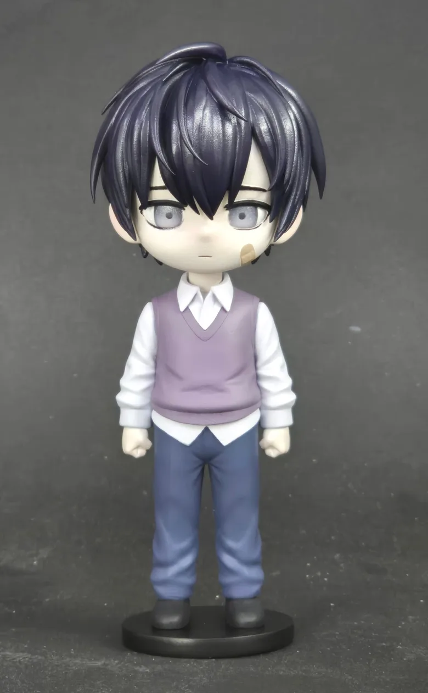

 

## Why I made this

I made it to learn Blender and to experiment with interaction and staging on the web.

**Why not Unity?** 
At first this was only a way to practice Blender modeling: a simple interactive page where things respond when you click them. That is why I framed it as "web content" from the start. I ended up with time to spare, and the world grew from there.

**Asset management** 
I did not want remote storage as one more thing to maintain, so every asset is compressed as far as it will go and kept inside the repo.

**How it went** 
It was fun to try several AI tools side by side, and the Blender I picked up keeps coming in handy elsewhere.

 

## Tools

Most assets are AI-generated, with some made by hand. Each AI asset went through several rounds of retouching and cleanup.

Tools used: Claude, GPT, Midjourney, Higgsfield, Tripo AI, ElevenLabs, and others.

 

## Design notes

### Game design

**Brightness follows the story** 
The emotional arc is a V: ordinary → dark → facing it. The brightness of the screen carries that arc.  
The space follows the same axis. The route starts in the bedroom and passes through the living room, the bathroom and the parents' room before it reaches the front door.

**Act 1 is minigames; from Act 2 on it is a puzzle hunt** 
Both parts use the same controls, but they are for different things.

| | Act 1: the bedroom | Act 2 onward: the whole house |
| --- | --- | --- |
| What you do | One minigame per object: a fighting game, batting, wiping a photo, tuning a radio, and so on | Examine the same objects again and connect scattered clues to open what is locked |
| What it means | **Looking away.** Playing the minigames is itself the protagonist's escape from reality | **Facing it.** Each clue you fit together brings you closer to the truth he avoided |
| Instructions | The controls are explained on screen when the game starts | The puzzles come with no rules. Working out what you are supposed to do is the first part of the puzzle |
| Answer | You solve it right there, by hand | The answer is in another room |

Trips between the bedroom and the living room are kept to two or three so they do not feel like errands.

### Rules

**Script management** 
The whole script and game flow live in four YAML files under `content/`.  
`pnpm content:build` validates them and splits the output in two: the TypeScript the game reads holds only text keys, and the text itself goes to the ko/en/ja translation files.  
If a reference points at a script that does not exist, a line is used nowhere, or the examine order deadlocks on itself, the build stops without writing any file.  
Empty English and Japanese fields are not blocked, only counted as "translation TODO", so the script can be written in Korean first and translated later.

**Admin page for editing the script** 
The dev server has a form editor at `/admin`. It shows the three languages side by side, and the flow tab expands each line into its text rather than its id, in the order it actually unlocks. Saving runs the same validator as the build and edits the YAML in place, so planning comments survive. The files are named `*.dev.tsx`, so the page is never built for production.

**Every asset lives in the repo** 
With no remote storage, the repo has to stay light, so each asset type has a fixed format and a per-file limit.  
Models are Meshopt-compressed glb up to 5MB, textures are webp up to 2MB, BGM is ogg up to 3MB, video is mp4 up to 15MB, and any file over 25MB is blocked from being committed at all.
- `pnpm model:prep`: compresses a glb exported from Blender, checks its base height, embedded textures and size with the real loader, and puts it in place if it passes. If it fails, it says what to fix in Blender.
- A pre-commit hook blocks large files, and CI checks the asset rules once more.
- The service worker reads assets cache-first, so replacing a file also requires bumping the `?v=` version on its URL.

**Rules for AI** 
`AGENTS.md` and `.claude/rules/` hold separate rule files for 3D performance (no state updates in per-frame code, for example), assets, the script, and minigames.  
Scaffolding a new minigame or scene, compressing assets, and checking design tokens are set up as skills.  
Colors and spacing come only from the tokens in `DESIGN.md`.

These rule files and the documents under `docs/` are written in Korean.

 

## License

The source code is [MIT](LICENSE).
The script and text (`content/`, `src/i18n/locales/`) and the assets (models, images, music, video and fonts in `public/`, and the images in `docs/`) are not covered by MIT. Work by the author may not be used without permission, and third-party assets follow the licenses listed in [CREDITS](public/assets/CREDITS.md).

 

---

 
This game was made with support from the <b>2026 Gyeonggi Youth Gap Year Program</b> of Gyeonggi Province and the Gyeonggi Future Generation Foundation.

