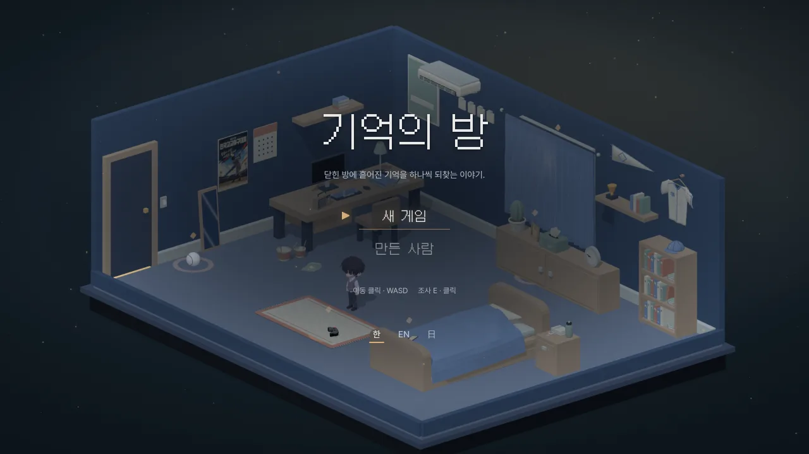
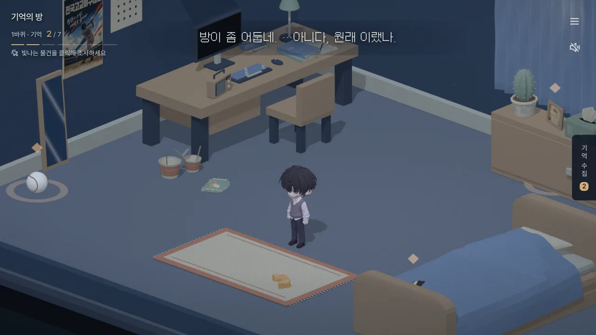
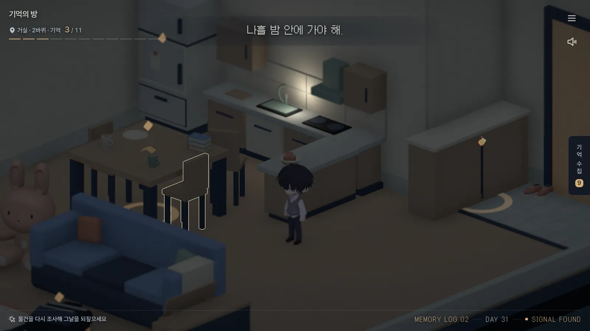
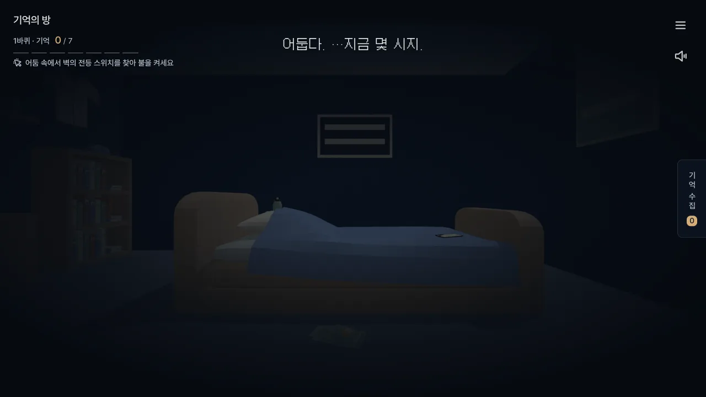

# 기억의 방 · Room of Memory

3D 웹 미니게임이자 비주얼 노벨이자 미궁게임. 
해보고 싶은 거 다 짬뽕한 어떤 것입니다.

 

 

## 화면

<table>
<tr>
<td width="50%"></td>
<td width="50%"></td>
</tr>
<tr>
<td align="center">방</td>
<td align="center">거실</td>
</tr>
<tr>
<td></td>
<td></td>
</tr>
<tr>
<td align="center">불 끄고 시작</td>
<td align="center">수첩</td>
</tr>
</table>

 

## 만든 의도

블렌더를 다룰 줄 알면 여기저기 하고 있는 일에 도움이 될 것 같아서 공부가 필요했는데, 그 핑계로 만든 프로젝트입니다.

**왜 Unity3D가 아닌가.** 
처음엔 모델링을 배우면서 클릭하면 반응이 오는 정도의 간단한 인터랙티브 웹을 하나 만들 생각이었습니다. 그래서 주제도 게임이 아니라 '콘텐츠'로 잡았는데, 만들다 보니 시간이 남아서 내용물이 좀 늘어났습니다.

**에셋.** 
원격 스토리지를 두면 관리 포인트가 늘어나는 게 싫어서, 모든 에셋을 최대한 압축해 리포 안에 밀어넣었습니다.

**결과.** 
AI를 여러 개 써볼 수 있어서 재밌었고, 배운 블렌더도 요긴하게 쓰고 있습니다.

 

## 제작 툴

3D와 일러스트는 자체 제작도 있고 AI도 있습니다.

사용 툴: Claude, GPT, Tripo AI 등.

 

---

 
본 게임은 경기도와 경기도미래세대재단의 <b>&lt;2026년 경기청년 갭이어 프로그램&gt;</b>의 지원을 받아 제작되었습니다.

