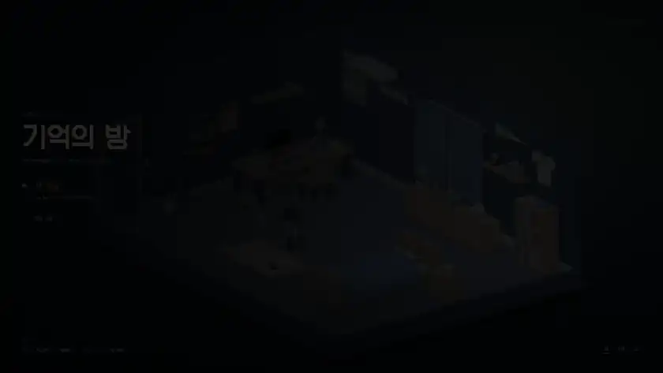
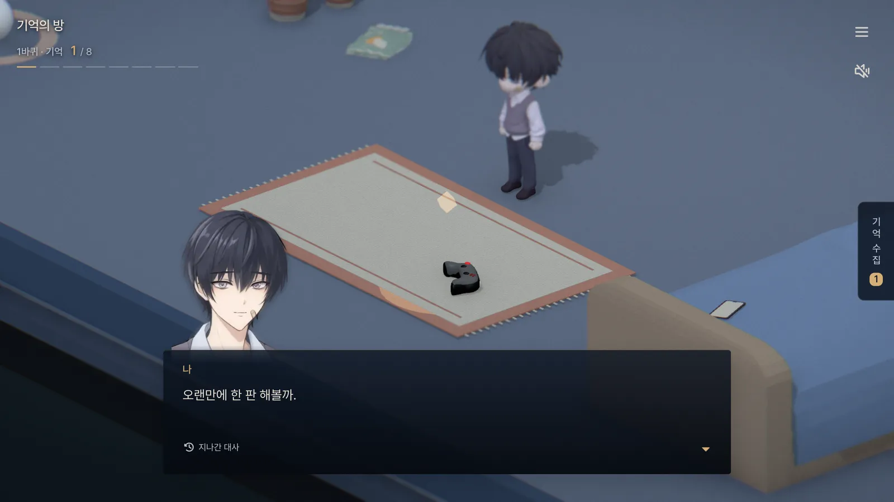
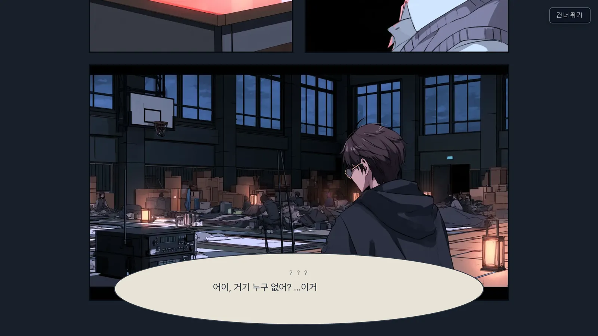

# 기억의 방 · Room of Memory

3D 웹 미니게임이자 비주얼 노벨이자 미궁게임. 
해보고 싶은 거 다 짬뽕한 어떤 것입니다.

 

 

## 플레이 영상

누르면 소리 있는 영상(40초)이 열립니다

 

## 화면

<table>
<tr>
<td width="50%"></td>
<td width="50%"></td>
</tr>
<tr>
<td align="center">방</td>
<td align="center">거실</td>
</tr>
<tr>
<td></td>
<td></td>
</tr>
<tr>
<td align="center">회상</td>
<td align="center">생존자 방송</td>
</tr>
<tr>
<td></td>
<td></td>
</tr>
<tr>
<td align="center">미니게임</td>
<td align="center">수첩</td>
</tr>
</table>

 

## 포토카드 AR

포토카드 앞면을 폰 카메라로 비추면 카드 속 도해가 튀어나옵니다 (`/ar`).

<table>
<tr>
<td width="33%"></td>
<td width="33%"></td>
<td width="33%"></td>
</tr>
<tr>
<td align="center">카드 비추기</td>
<td align="center">튀어나오기</td>
<td align="center">동작 고르기</td>
</tr>
</table>

 

## 만든 의도

블렌더를 다룰 줄 알면 여기저기 하고 있는 일에 도움이 될 것 같아서 공부가 필요했는데, 그 핑계로 만든 프로젝트입니다.

**왜 Unity3D가 아닌가.** 
처음엔 모델링을 배우면서 클릭하면 반응이 오는 정도의 간단한 인터랙티브 웹을 하나 만들 생각이었습니다. 그래서 주제도 게임이 아니라 '콘텐츠'로 잡았는데, 만들다 보니 시간이 남아서 내용물이 좀 늘어났습니다.

**에셋.** 
원격 스토리지를 두면 관리 포인트가 늘어나는 게 싫어서, 모든 에셋을 최대한 압축해 리포 안에 밀어넣었습니다.

**결과.** 
AI를 여러 개 써볼 수 있어서 재밌었고, 배운 블렌더도 요긴하게 쓰고 있습니다.

 

## 제작 툴

3D와 일러스트는 자체 제작도 있고 AI도 있습니다. AI가 뽑은 걸 손으로 리터칭하고, 그걸 다시 AI에 넣어 다듬는 핑퐁을 여러 번 돌렸습니다.

사용 툴: Claude, GPT, Midjourney, Higgsfield, Tripo AI 등.

 

## 설계 의도

### 게임 설계

**밝기가 곧 진행도.** 
처음엔 조금 어수선할 뿐인 평범한 방입니다. 물건을 조사할수록 세계의 진실이 드러나며 방이 점점 어두워지고, 가장 어두운 순간 라디오 너머 목소리를 계기로 다시 밝아집니다. 감정선이 평범 → 어둠 → 직면으로 흐르는 V자이고, 화면의 밝기가 그 감정을 그대로 따라갑니다. 공간도 같은 축을 탑니다. 방에서 시작해 거실, 화장실, 안방을 지나 현관에 닿는 동선이 곧 회복의 단계입니다.

**1막은 미니게임, 2막부터는 미궁.** 
두 구간은 같은 조작을 쓰지만 목적이 다릅니다.

| | 1막: 방 | 2막 이후: 집 전체 |
| --- | --- | --- |
| 하는 일 | 물건 하나에 미니게임 하나. 격투 게임, 배팅, 사진 닦기, 라디오 주파수 맞추기 등 | 같은 물건을 다시 조사하고, 흩어진 단서를 이어 잠긴 곳을 연다 |
| 의미 | **외면의 체험.** 게임을 하고 공을 치는 행위 자체가 주인공의 현실 도피다. 이 의미는 나중에야 밝혀진다 | **직면의 체험.** 단서를 맞출수록 외면했던 진실에 가까워진다 |
| 규칙 안내 | 시작할 때 화면 안에서 조작법을 알려 준다 | 미궁 문제에는 규칙 설명이 없다. 무엇을 해야 하는지 찾아내는 것부터가 문제다 |
| 답 | 그 자리에서 손으로 푼다 | 답이 다른 방에 있다. 피아노의 지워진 마디는 안방의 악보 조각이, 세면대 하부장의 번호는 방의 물건들이 쥐고 있다 |

방과 거실을 오가는 횟수는 심부름처럼 느껴지지 않도록 두세 번으로 묶었습니다.

**진행은 저장하지 않고 계산한다.** 
저장하는 건 "무엇을 몇 번째까지 봤는가"와 문·물건 상태뿐입니다. 지금이 몇 막인지는 거기서 계산합니다. 그래서 대본을 고쳐 조사 순서가 바뀌어도 예전 저장본이 엉뚱한 막에 갇히지 않습니다.

### 만드는 방식

**대사는 코드가 아니라 YAML.** 
대본과 게임 흐름은 `content/` 아래 YAML 네 개가 전부입니다(기억 16개, 대사 스크립트 31개, 컷씬 10개, 방 단계 11개). `pnpm content:build`가 이걸 검증한 뒤 두 갈래로 나눕니다. 게임이 읽는 TypeScript에는 대사 키만 들어가고, 본문은 ko/en/ja 번역 파일로 갑니다. 없는 스크립트를 가리키거나, 아무 데서도 안 쓰이는 대사가 있거나, 조사 순서가 서로를 기다리며 꼬이면 파일을 하나도 쓰지 않고 멈춥니다. 한국어로 먼저 쓰고 번역은 나중에 채울 수 있도록, 빈 영어·일본어 칸은 막지 않고 "번역 TODO"로 세기만 합니다.

**대본 편집용 어드민.** 
YAML을 직접 여는 대신 dev 서버의 `/admin`에서 폼으로 고칩니다. 세 언어를 나란히 놓고, 흐름 탭에서는 대사를 id가 아니라 본문으로 펼쳐 실제로 열리는 순서대로 보여 줍니다. 저장할 때 빌드와 같은 검증기를 거치고, YAML을 제자리에서 고쳐서 기획 메모 주석도 남습니다. 파일 이름이 `*.dev.tsx`라 프로덕션 빌드에는 이 페이지가 아예 만들어지지 않습니다.

**에셋은 전부 리포 안에.** 
원격 스토리지를 두면 관리 포인트가 하나 더 늘어납니다. 그게 싫어서 에셋을 전부 리포에 넣기로 했고, 대신 리포가 무거워지지 않도록 종류별 포맷과 파일당 한도를 정했습니다. 모델은 Meshopt 압축 glb로 5MB, 텍스처는 webp로 2MB, BGM은 ogg로 3MB까지이고, 25MB가 넘는 파일은 커밋 자체를 막습니다. 지금 에셋 전체가 26MB이고, 그중 3D 모델 32개를 다 합쳐 2.9MB입니다.
- `pnpm model:prep`: 블렌더에서 뽑은 glb를 압축하고, 밑면 높이·텍스처 내장·용량을 실제 로더로 검사한 뒤 통과하면 제자리에 넣습니다. 틀리면 블렌더에서 무엇을 고쳐야 하는지 알려 줍니다.
- 커밋 전 훅이 큰 파일을 막고, CI가 에셋 규칙을 한 번 더 검사합니다.
- 서비스 워커가 에셋을 캐시에서 먼저 읽기 때문에, 파일을 바꾸면 참조 URL의 `?v=` 버전도 반드시 올리게 했습니다.

**AI에게 주는 규칙.** 
코드는 대부분 Claude Code와 Codex가 썼습니다. 그래서 `AGENTS.md`와 `.claude/rules/`에 3D 성능 규칙(매 프레임 도는 코드에서 상태 변경 금지 등), 에셋 규칙, 대본 규칙, 미니게임 규칙을 나눠 적었습니다. 새 미니게임·씬 뼈대 만들기, 에셋 압축, 디자인 토큰 검사는 스킬로 만들어 두었습니다. 색과 간격은 `DESIGN.md` 토큰에서만 가져오게 했습니다. 커밋 전에는 lint, 푸시 전에는 타입 검사와 빌드가 돌아서, AI가 쓴 코드도 같은 문턱을 넘어야 들어옵니다.

 

## 라이선스

소스 코드는 [MIT](LICENSE)입니다.
대본·텍스트(`content/`, `src/i18n/locales/`)와 에셋(`public/`의 모델·그림·음악·영상·폰트, `docs/`의 이미지)은 MIT에 포함되지 않습니다. 제작자 저작물은 무단 사용을 금하고, 외부 에셋은 [CREDITS](public/assets/CREDITS.md)에 적힌 각 라이선스를 따릅니다.

 

---

 
본 게임은 경기도와 경기도미래세대재단의 <b>&lt;2026년 경기청년 갭이어 프로그램&gt;</b>의 지원을 받아 제작되었습니다.

