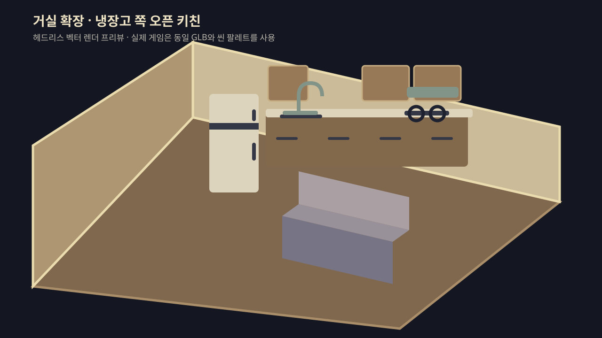

# 거실–부엌 3D 확장 검토

> 검토일: 2026-10-01
>
> 범위: 냉장고 쪽에 작은 부엌을 만들면서 현재 거실 자체를 확장하는 방안
>
> 상태: **구현 및 검증 완료 / GitHub 인증·네트워크 연결 대기**



## 결론

사용자가 제안한 것처럼 **문이나 별도 `kitchen` 공간을 추가하지 않고 거실 경계를 넓히는
편이 더 낫다.** 부엌은 독립된 방이 아니라 냉장고가 있는 거실 뒤쪽의 작은 오픈 키친으로
구성한다. 플레이어에게도 “새 방을 해금했다”가 아니라 “원래 한 공간이었던 거실과 부엌을
둘러본다”로 읽히므로 현재 집의 구조와 이야기 흐름에 더 자연스럽다.

이전 검토에서 단순 경계 확장을 권장하지 않았던 이유는 기존 뒷벽에 붙은 소파와 냉장고가
확장 후 방 한가운데 남는 문제 때문이었다. 하지만 이 문제는 별도 공간과 문을 추가하지 않아도
**가구를 새 외벽 기준으로 재배치**하면 해결된다. 오히려 하나의 `living` 공간을 유지하면
새 공간 ID, 문 상태, 저장 마이그레이션, 해금 규칙, 수첩 방 칸을 만들 필요가 없어 구현과
플레이 경험이 모두 단순해진다.

## 확정 방향

- 거실의 `-z` 경계를 뒤로 늘려 거실 전체 깊이를 키운다.
- 기존 냉장고가 있는 `-x / -z` 모서리에 작은 부엌을 만든다.
- 거실과 부엌 사이에는 문, 문틀, 문턱을 두지 않는다.
- 부엌은 `kitchen`이라는 새 `SpaceId`가 아니라 기존 `living` 공간의 한 구역이다.
- 냉장고는 새 부엌 외벽 쪽으로 옮기되 기존 조사, 서랍, 앰플 획득 흐름은 유지한다.
- 소파는 확장된 새 뒷벽에 맞춰 뒤로 옮기거나, 부엌과 거실을 나누는 낮은 경계 가구처럼
  재배치한다. 첫 프로토타입에서 두 배치를 비교한다.
- 화장실문, 안방문, 현관문, 방문 위치와 이야기 진행 조건은 바꾸지 않는다.

## 평면 초안

기존 거실의 `x = -16.5 ~ -6`, `z = -4 ~ 6.5` 범위에서 `minZ`를 `-7.5`까지
늘려 깊이를 3.5유닛 추가했다.

```text
  새 거실 뒷벽 (z = -7.5)
  +-----------------------------------------------+
  | 냉장고  조리대  싱크  레인지 | 수납/여유 공간 |
  |           작은 오픈 키친      |               |
  |-------------------------------+               |
  | 식탁 또는 아일랜드     소파/러그      TV       |
  |                                               |
  | 안방문 · 신발장 · 현관문                      | 기존 방문
  +---------------- 화장실문 ---------------------+
```

### 배치 원칙

1. **부엌은 냉장고 쪽에 집중한다.** 새로 늘어난 뒤쪽 전체를 주방 가구로 채우지 않고,
   `-x / -z` 모서리 약 4~5유닛 폭만 사용한다.
2. 냉장고 옆으로 일자형 조리대와 싱크를 먼저 둔다. L자형은 보기에는 좋지만 좁은 코너의
   AABB 충돌과 카메라 가림을 확인한 뒤 선택한다.
3. 거실 중앙에는 기존보다 넓은 빈 바닥을 남긴다. 공간을 키운 목적이 가구를 더 채우는 것이
   아니라 거실과 부엌을 자연스럽게 구분하고 이동 여유를 만드는 것이기 때문이다.
4. 식탁은 두 영역 사이의 완충 지점으로 옮길 수 있다. 단, 냉장고 조사 위치와 방문에서
   화장실·안방·현관으로 가는 주 동선을 막지 않아야 한다.
5. 부엌 천장이나 바닥 단차는 만들지 않는다. 시각적 구분은 조리대 배치, 작은 러그 또는 바닥
   재질 구획으로만 처리해 이동 판정을 단순하게 유지한다.

## 이 방식이 더 단순한 이유

### 공간과 저장 상태

- `SPACE_IDS`와 `DOORWAY_IDS`를 바꾸지 않는다.
- 새 문을 열었다는 상태를 저장하거나 예전 저장 데이터를 마이그레이션할 필요가 없다.
- 거실에 들어오면 부엌도 즉시 보이고 걸어갈 수 있다.
- 이야기 페이즈, 다음 행동 안내, 열쇠/문 규칙에 부엌을 끼워 넣지 않아도 된다.

### 이동과 카메라

- `LIVING_SHELL_BOUNDS`와 `LIVING_BOUNDS`만 확장하면 기존 A* 클릭 이동이 넓어진 보행 영역을
  그대로 사용한다.
- `followLimits`도 거실의 새 경계를 자동으로 반영한다.
- 별도 공간 전환이 없으므로 거실과 부엌 사이에서 카메라 중심이나 조명이 순간적으로 바뀌지
  않는다.
- 0.25 단위 A* 격자의 행 수는 늘어나지만, 깊이 약 3유닛 확장은 현재 집 전체 규모에서 작은
  증가다. 구현 후 클릭 경로 계산 시간을 확인한다.

### 수첩 평면도

- 방 칸을 하나 더 만들지 않고 기존 거실 도형만 뒤로 길어진다.
- 수첩에서 사용자가 누르는 이동 대상도 계속 `living` 하나다.
- 별도의 부엌 공간명과 다국어 번역은 필요하지 않다.

## 구현 시 꼭 고쳐야 하는 구조

### 1. 확장 구간의 `+x` 벽

현재 거실의 `+x` 벽은 침실의 `-x` 벽과 공유하므로 `LivingRoomShell`에서 별도로 그리지
않는다. 하지만 거실을 `-z` 방향으로 늘리면 새 구간에는 맞닿는 침실이 없다. 이 구간까지
벽을 생략하면 부엌 오른쪽이 허공으로 열린다.

따라서 기존 공유벽 범위에는 지금처럼 침실 벽을 사용하고, 새로 늘어난 구간
(`새 minZ ~ 기존 minZ`)에만 거실 소유의 `+x` 벽과 굽도리를 추가해야 한다. 이 벽도 카메라
방향에 따라 걷히도록 `CulledWall` 규칙을 적용한다.

### 2. 기존 뒷벽과 벽 부착 가구

기존 `z = -4` 뒷벽은 제거되고 새 `minZ`에 다시 생긴다. 기존 뒷벽 기준으로 배치된 다음
요소를 함께 확인한다.

- 소파 및 소파 충돌체
- 냉장고 및 냉장고 충돌체
- 벽 장식과 굽도리
- 거실 조명 위치와 그림자 범위
- 가구 기준점인 `LIVING_ANCHORS.sofa`, `LIVING_ANCHORS.fridge`

벽만 움직이고 이 요소를 그대로 두면 소파와 냉장고가 공간 한가운데 떠 있게 된다.

### 3. 냉장고에 연결된 상호작용

냉장고는 단순 장식이 아니다. 다음 값을 동일한 새 기준점에서 함께 옮겨야 한다.

- 냉장고 메시와 문/서랍 부품
- `LIVING_COLLIDERS`의 냉장고 발자국
- `MEMORY_PLACEMENTS.fridge`
- 냉장고 조사 카메라 프리셋
- 하부 서랍을 여는 근접 위치
- 앰플을 집는 Canvas 미니게임 위치

좌표를 여러 곳에서 각각 보정하기보다는 냉장고 기준점 하나를 정의하고 렌더링, 충돌, 조사,
카메라가 모두 그 기준점을 사용하도록 정리하는 편이 안전하다.

## 단계별 구현 계획

### 1단계 — 거실 확장 프로토타입 ✅

- `LIVING_SHELL_BOUNDS.minZ`를 `-7.5`로 확장한다.
- 바닥, 받침, 새 뒷벽과 확장 구간의 `+x` 측벽을 만든다.
- 거실 보행 범위와 카메라 한계를 새 경계에 맞춘다.
- 임시 상자로 냉장고, 일자 조리대, 싱크, 레인지 위치를 잡는다.
- 소파를 새 뒷벽으로 옮기는 안과 현재 영역의 구획 가구로 두는 안을 비교한다.
- 기존 방문, 화장실문, 안방문, 현관문 사이를 모두 직접 걸어 보며 동선을 확인한다.

### 2단계 — 부엌 가구와 냉장고 이전 ✅

- `KitchenFurniture.tsx`를 추가하되 별도 공간이 아니라 `LivingRoomFurniture` 안에서 렌더한다.
- 조리대, 싱크, 하부장, 레인지와 최소한의 소품을 코드 프리미티브로 먼저 만든다.
- 냉장고 렌더링, 충돌, 기억 조사, 카메라, 서랍/앰플 연출을 새 위치로 함께 옮긴다.
- 식탁과 러그를 확장된 평면에 맞춰 조정하고 통로 폭을 테스트한다.

### 3단계 — 시각 마감과 성능 확인 ✅

- 기존 팔레트와 DESIGN.md 토큰으로 거실과 연결되는 재질을 구성한다.
- 반복되는 장 문짝과 손잡이는 공유 지오메트리/머티리얼 또는 인스턴싱으로 묶는다.
- 조리대와 바닥의 색/재질 차이만으로 부엌 영역을 읽을 수 있는지 확인한다.
- 데스크톱과 모바일에서 프레임, 그림자, 벽 가림, 클릭 경로를 확인한다.
- 최종 GLB가 필요할 때만 `pnpm model:prep <내보낸.glb> <이름>`으로 추가한다.

## 예상 변경 지점

| 영역 | 주요 파일 | 변경 이유 |
|---|---|---|
| 평면/충돌 | `src/scenes/memory-room/layout.ts` | 거실 경계 확장, 새 주방/가구 발자국, 냉장고 기준점 |
| 거실 껍데기 | `src/scenes/memory-room/LivingRoomShell.tsx` | 바닥/뒷벽 확장과 새 `+x` 측벽 |
| 가구 | `src/scenes/memory-room/LivingRoomFurniture.tsx` | 소파·식탁 재배치, 냉장고 이전 |
| 부엌 가구 | `src/scenes/memory-room/KitchenFurniture.tsx` | 거실 내부의 부엌 구성 분리 |
| 조사/카메라 | `src/scenes/memory-room/layout.ts`, `FridgeDrawer.tsx` | 냉장고와 연결된 좌표 동기화 |
| 지도 | `src/components/ui/notebook-map.ts` | 확장된 거실 도형 표시 확인 |
| 검증 | `layout.test.ts`, `spaces.test.ts`, `notebook-map.test.ts` 등 | 동선, 충돌, 평면도 회귀 방지 |

`spaces.ts`의 공간/문 목록, 문 규칙, 이야기 콘텐츠 YAML은 원칙적으로 변경하지 않는다.

## 예상 작업량

| 범위 | 예상 작업량 | 포함 내용 |
|---|---:|---|
| 확장 동선 프로토타입 | 0.5~1일 | 바닥/벽/보행/임시 가구와 카메라 확인 |
| 기본 오픈 키친 완성 | 2~3일 | 기본 가구, 냉장고 이전, 식탁/소파 재배치, 테스트 |
| 맞춤 모델과 세부 소품 포함 | 3~5일 이상 | GLB 제작/적용, 텍스처, 장식, 모바일 최적화 |

작업량은 새로운 기억, 대사, 퍼즐을 추가하지 않는 기준이다. 이번 방향은 공간 해금이 아니므로
기존 냉장고 콘텐츠만 유지하는 것이 적절하다.

## 라이브러리 검토

추가 라이브러리는 필요하지 않다. 현재 three.js, React Three Fiber, drei와 기존 A* 보행
구현으로 거실 경계 확장과 부엌 가구 배치를 모두 처리할 수 있다. 새 물리 또는 경로 탐색
라이브러리를 설치하면 같은 거실 안에서 이동 체계만 이중화되므로 이 작업에는 이점이 없다.

## 주의사항

- 확장된 구간의 `+x` 벽을 반드시 별도로 만들어 허공이 보이지 않게 한다.
- 뒷벽 좌표만 바꾸지 말고 소파, 냉장고, 벽 장식, 충돌체를 함께 재배치한다.
- 냉장고의 메시만 옮기면 조사 카메라와 앰플 연출이 옛 위치에 남으므로 기준점 기반으로
  연결 좌표를 모두 옮긴다.
- 주방 가구가 방문에서 화장실·안방·현관으로 가는 기존 동선을 침범하지 않게 한다.
- 거실이 깊어지면 카메라 줌아웃 시 빈 바닥이 과하게 보일 수 있으므로 확장 폭을 먼저 작게
  잡고 플레이 화면에서 늘린다.
- 조리대 문짝과 소품을 독립 메시로 과도하게 늘리지 않는다. 모바일 60fps 목표를 위해 공유
  재질과 인스턴싱을 우선한다.
- 외부 에셋을 사용하면 라이선스와 출처를 `public/assets/CREDITS.md`에 기록하고, GLB는 압축 후
  파일당 5MB 이내를 기본 목표로 한다.
- PR 전송 계층이 GLB·PNG 같은 바이너리 diff를 지원하지 않아 생성된 GLB는 Git에 넣지 않는다.
  대신 `pnpm dev`와 `pnpm build`의 사전 스크립트가 재질별 병합·인덱싱된 136KB GLB를 로컬
  `public/assets/models/`에 매번 생성한다. 캡처도 같은 이유로 텍스트 SVG를 커밋한다.

## 사용자가 해야 할 일

현재 단계에서 필수로 제공해야 할 파일이나 작업은 없다. 첨부 캡처를 보고 다음 한 가지만
확인하면 된다.

1. 현재처럼 소파를 기존 위치에 두어 거실과 부엌의 낮은 경계로 사용하는 배치가 괜찮은지
   확인한다. 더 넓은 거실 바닥을 원하면 다음 수정에서 소파를 앞쪽이나 옆쪽으로 옮긴다.

## 작업 진행상황

- [x] 프로젝트 기술 스택과 3D/에셋 규칙 확인
- [x] 현재 거실 경계와 냉장고 쪽 인접 공간 검토
- [x] 문이나 새 공간 없이 거실을 확장하는 방향으로 검토 수정
- [x] 확장 구간의 누락 측벽과 냉장고 연동 좌표 위험 확인
- [x] 단계별 구현 범위와 예상 작업량 갱신
- [x] 확장된 거실 바닥/벽과 누락 측벽 구현
- [x] 오픈 키친 GLB 생성기와 씬 연결
- [x] 냉장고 조사·서랍·앰플 위치와 충돌체 이전
- [x] 확장 동선과 조리대 앞 보행 테스트 추가
- [x] 변경 장면의 헤드리스 렌더 프리뷰 캡처 생성
- [x] PR 바이너리 제한 대응: GLB는 predev/prebuild 생성, 캡처는 SVG로 전환
- [x] lint, typecheck, 전체 테스트, 빌드, 에셋 검사
- [x] `.git/FETCH_HEAD`에서 원본 저장소 주소 확인
- [x] `origin`을 `https://github.com/suu3/room-of-memory.git`으로 등록
- [ ] 원격 브랜치 fetch 및 PR 생성 (GitHub 연결이 HTTP 403이고 `gh`가 미인증이라 대기)
- [ ] 사용자의 최종 배치 확인

## Next action items

1. 사용자가 GitHub 인증이 연결되고 `github.com` 접속이 허용된 환경에서 브랜치를 푸시한다.
2. 푸시한 브랜치에서 `develop`을 base로 실제 GitHub Pull Request를 생성한다.
3. 사용자가 배포된 화면에서 거실 크기, 부엌 비율과 소파 배치를 확인한다.
4. 배치 피드백이 있으면 소파/식탁 위치와 조리대 폭만 미세 조정한다.
5. 필요하면 `node scripts/create-living-kitchen.mjs`를 직접 실행해 GLB를 다시 생성한다.

## 배포 상태와 사용자 조치

- 구현 자체는 완료되었고 전체 테스트와 프로덕션 빌드도 통과했다.
- 처음에는 `.git/config`에 원격이 없었지만 `.git/FETCH_HEAD`에서 원본 주소
  `https://github.com/suu3/room-of-memory`를 확인해 `origin`으로 등록했다.
- 등록 후 `git fetch origin develop`을 실행했으나 프록시가 GitHub 연결을 HTTP 403으로
  거부했다. `gh auth status`도 로그인되지 않은 상태를 확인했다.
- 앞서 호출한 `make_pr` 도구는 GitHub에 PR을 생성하는 도구가 아니라 PR 제목과 본문 메타데이터를
  기록하는 내부 도구였다. 브랜치가 원격에 올라가지 않았으므로 실제로 머지 가능한 GitHub PR은
  생성되지 않았다.
- 사용자가 해야 할 일은 GitHub 인증과 네트워크가 제공되는 환경에서 현재 `work` 브랜치를
  푸시하고 `develop` 대상 PR을 생성하는 것이다. 코드나 에셋을 다시 만들 필요는 없다.
- PR의 바이너리 파일 제한은 제거했다. GLB는 `predev`/`prebuild`가 생성하고 렌더 캡처는
  SVG이므로 변경 이력은 텍스트 파일만으로 전송할 수 있다.
